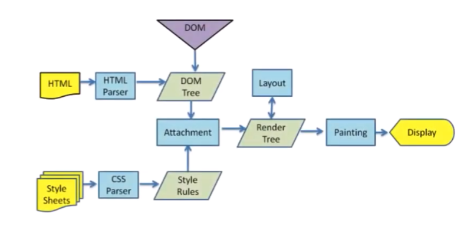
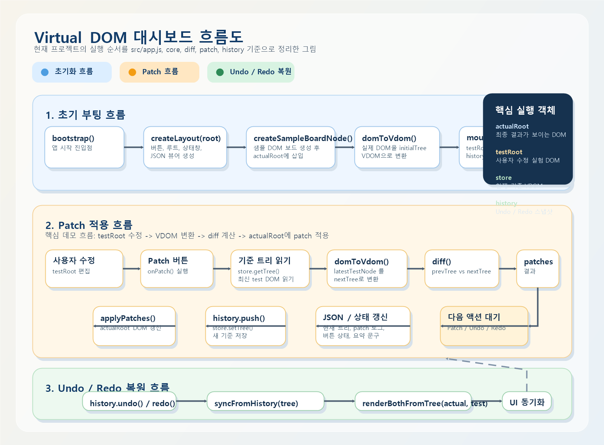

# Nexus Home
실시간으로 집안의 모든 기기 상태를 모니터링하고 제어하는 Virtual DOM 기반 대시보드입니다.

## 프로젝트 소개

`Nexus Home (넥서스 홈)`은 실제 스마트홈 시나리오를 통해 Virtual DOM의 핵심 동작을 시각적으로 보여주는 데모 프로젝트입니다.

이 주제는 상태 변화가 자주 일어나는 서비스라 Virtual DOM 장점인 부분 갱신을 가장 잘 보여줄 수 있어서 선택했습니다.

 

# Virtual DOM이란?

Virtual DOM은 실제 화면 DOM을 그대로 조작하지 않고, 같은 구조를 자바스크립트 객체 트리로 한 번 더 표현한 것입니다.  
핵심은 전체를 다시 그리는 게 아니라, 이전 트리와 다음 트리의 차이만 계산해서 필요한 변경만 반영하는 데 있습니다.

 

# Virtual DOM을 왜 쓰는가?

실제 DOM을 직접 자주 건드리면 변경 추적이 어렵고, 화면이 커질수록 관리 비용이 커집니다.  
 
Virtual DOM을 쓰면 변경을 트리 비교로 다룰 수 있어서 다음과 같은 장점이 있습니다.

- 변경 범위를 명확히 알 수 있다.
- 필요한 부분만 반영할 수 있다.
- 상태 스냅샷 기반으로 Undo/Redo 같은 기능도 쉽게 붙일 수 있다.

 

# Virtual DOM Flow

 
사용자 수정 -> `testRoot`를 VDOM으로 변환 -> `diff` 계산 -> `Patch` 버튼으로 `actualRoot` 반영 -> `history` 저장

## Flow 상세 (코드 베이스 기준)

1. `bootstrap()`에서 초기 DOM을 만들고 `domToVdom()`으로 `initialTree`를 생성합니다.
2. `mountVdom()`으로 같은 트리를 `testRoot`에 렌더링해 편집 영역을 준비합니다.
3. 사용자가 test 영역을 수정하면 `getDraftDiff()`가 test DOM을 다시 VDOM으로 변환합니다.
4. `diff(store.getTree(), nextTree)`로 patch 목록을 계산합니다.
5. `renderDraftDiff()`가 patch JSON/트리 프리뷰를 실시간 갱신합니다.
6. `Patch` 클릭 시 `applyPatches()`가 `actualRoot`에 최소 변경만 반영합니다.
7. 반영 후 `store.setTree(nextTree)`, `history.push(nextTree)`로 기준 상태를 업데이트합니다.
8. `Undo/Redo`는 diff 재계산이 아니라 history 스냅샷 복원으로 동작합니다.

 

# CORE
VNODE의 구조를 선언하는 역할을 합니다.

CORE는 DOM과 VDOM 사이 변환/렌더링을 담당합니다.

- `domToVdom()`이 실제 DOM을 VDOM 트리로 만든다.
- `mountVdom()`이 VDOM을 다시 실제 DOM으로 렌더링한다.

즉, 비교 가능한 데이터 구조를 만드는 기반 계층입니다.

## CORE 상세

- `createElementVNode(tag, props, children)`:
  element 노드를 표준 VNode 구조로 변환하며 `key`(`props.key` 또는 `data-key`)를 함께 보관합니다.
- `createTextVNode(text)`:
  텍스트를 독립 노드로 다뤄 `TEXT` patch를 정확하게 계산할 수 있게 합니다.
- `domToVdom(node)`:
  실제 DOM을 재귀 순회해 VDOM 트리로 변환합니다.
  이때 comment와 공백 text를 제외해 path 인덱스 안정성을 확보합니다.
- `renderVdom(vnode)`:
  VDOM을 실제 DOM으로 복원합니다. (태그 생성 -> props 반영 -> children 재귀 렌더)
- `mountVdom(container, vnode)`:
  컨테이너의 현재 내용을 최신 VDOM 결과로 교체합니다.

핵심 목적은 "DIFF가 신뢰할 수 있는 비교 기준 트리"를 만드는 것입니다.

 

# DIFF

DIFF는 이전 트리와 다음 트리를 비교해 patch 목록을 만듭니다.  
이 프로젝트 기준 patch 타입은 `CREATE`, `REMOVE`, `REPLACE`, `TEXT`, `PROPS`, `MOVE`입니다.  
요약하면 DIFF는 무엇이 달라졌는지 분석하는 단계입니다.

## 현재 diff 규칙

`diff.js`는 아래 순서로 비교합니다.

1. `oldNode`가 없고 `newNode`가 있으면 `CREATE`
2. `oldNode`가 있고 `newNode`가 없으면 `REMOVE`
3. 노드 타입이 다르거나 element tag가 다르면 `REPLACE`
4. 두 노드가 모두 text node이고 내용이 다르면 `TEXT`
5. 두 노드가 같은 element 타입이면 props를 비교하고 필요 시 `PROPS`
6. 자식 노드를 pair로 묶은 뒤, 같은 key를 가진 노드의 위치가 바뀌면 `MOVE`
7. 각 자식 pair를 재귀적으로 다시 비교

## React에서 실제 DOM 변경 시 Virtual DOM + Diff 동작 방식

React도 큰 흐름은 이 프로젝트와 같습니다.  
상태(state)가 바뀌면 새 UI를 바로 DOM에 쓰지 않고, 먼저 새 Virtual DOM(정확히는 React Element/Fiber 트리)을 만들고 이전 트리와 비교한 뒤 필요한 변경만 커밋합니다.

1. 상태 변경 발생 (`setState`, `useState` setter 등)
2. 새 Virtual DOM 트리 생성 (렌더 단계)
3. 이전 트리와 비교(Reconciliation, Diff)
4. 변경 목록을 확정한 뒤 실제 DOM에 반영 (Commit 단계)

핵심 규칙은 다음과 같습니다.

- 같은 타입의 노드는 재사용하고, props만 바뀌면 속성만 갱신합니다.
- 타입이 다르면 해당 서브트리를 교체합니다.
- 리스트는 `key`를 기준으로 항목을 추적해 이동/삽입/삭제를 최소화합니다.
- 실제 DOM 반영은 커밋 단계에서 한 번에 적용되어 불필요한 화면 갱신을 줄입니다.

즉 React의 본질도 동일합니다.  
"먼저 Virtual DOM에서 차이를 계산하고, 마지막에 필요한 변경만 실제 DOM에 커밋한다"가 핵심입니다.

## DIFF 상세

- 노드 타입 비교:
  타입/태그가 다르면 즉시 `REPLACE`를 생성해 하위 비교를 중단합니다.
- 텍스트 비교:
  text 노드는 값이 달라질 때만 `TEXT` patch를 생성합니다.
- 속성 비교:
  `diffProps()`가 `set`(추가/변경), `remove`(삭제)로 분리해 최소 변경만 산출합니다.
- 자식 비교:
  `collectChildPairs()`가 key 존재 여부에 따라 `keyed diff` 또는 `index diff`를 선택합니다.
- keyed reorder 대응:
  `keyedDiff`가 동일 key를 매칭해 이동(`MOVE`)을 감지하고 불필요한 교체를 줄입니다.
- patch 순서 계약:
  같은 부모 기준으로 `REMOVE -> CREATE -> MOVE -> REPLACE -> TEXT -> PROPS` 우선순위를 맞춰 PATCH 단계와 호환합니다.

핵심 목적은 "무엇을 바꿔야 하는지"를 최소 단위 patch 목록으로 만드는 것입니다.

 

# PATCH

PATCH는 DIFF 결과를 실제 DOM에 적용하는 실행 단계입니다.

- `applyPatches()`가 patch 순서를 정렬해 안전하게 반영한다.
- 적용 후에는 `store/history`를 갱신해 다음 비교 기준과 Undo/Redo 기준을 맞춘다.

즉 PATCH는 분석 결과를 화면에 반영하는 단계입니다.

## PATCH 상세

- patch 타입 호환:
  DIFF의 `PROPS`를 PATCH 단계에서 `UPDATE_PROPS`와 동등하게 처리해 팀 간 계약을 맞춥니다.
- path 기반 대상 탐색:
  `getNodeByPath()`/`getChildNodesForPath()`로 patch마다 DOM 대상을 다시 조회합니다.
  이전 patch로 구조가 바뀌어도 다음 patch가 안전하게 적용됩니다.
- 적용 순서 안정화:
  깊은 경로 우선, 같은 부모에서는 구조 변경 patch를 먼저 적용합니다.
- `MOVE` 처리:
  key가 있으면 key 우선으로 이동 대상을 찾아 `insertBefore` 기반으로 재배치합니다.
- 루트 patch 처리:
  `path=[]`인 경우 루트 교체/텍스트/속성 변경을 별도 분기 처리합니다.

핵심 목적은 "DIFF 결과를 DOM에 정확하고 안정적으로 커밋"하는 것입니다.

 

# 협업 방식

## 역할분할 (4인 기준)

### A. CORE 담당

- 담당 파일: `src/core/vnode.js`, `src/core/domToVdom.js`, `src/core/renderVdom.js`
- 책임: VNode 스펙, DOM<->VDOM 변환 정확성, path 인덱스 일관성

### B. DIFF 담당

- 담당 파일: `src/diff/diff.js`, `src/diff/diffProps.js`, `src/diff/diffChildren.js`, `src/diff/keyedDiff.js`
- 책임: patch 생성 규칙, keyed reorder 품질, patch 순서 계약 유지

### C. PATCH/STATE 담당

- 담당 파일: `src/patch/applyPatch.js`, `src/patch/domOps.js`, `src/state/store.js`, `src/state/history.js`
- 책임: patch 적용 안정성, MOVE/PROPS 반영 정확성, Undo/Redo 복원 일관성

### D. UI/통합 담당

- 담당 파일: `src/ui/*`, `src/app.js`, `src/styles/*`, `docs/*`
- 책임: 편집 이벤트 연결, draft diff 시각화, patch 실행 UX, 데모 시나리오

## 협업 체크리스트

1. 공통 계약 먼저 확정: VNode shape, patch 타입, path 규칙
2. DIFF/PATCH 통합 테스트 공유: CREATE/REMOVE/REPLACE/TEXT/PROPS/MOVE
3. 병합 순서 고정: CORE -> DIFF -> PATCH/STATE -> UI

 

# Mutation Observer (실제 DOM 변화 시각화)

이 프로젝트는 `actualRoot`에 `MutationObserver`를 연결해 실제 DOM mutation을 시각화합니다.  
Tree Visualizer 아래 패널에서 mutation 로그와 처리 메트릭을 확인할 수 있습니다.

## 동작 방식

1. `MutationObserver`가 `attributes`, `childList`, `characterData` 변화를 수집합니다.
2. 수집된 레코드는 `requestAnimationFrame` 단위로 먼저 배치(flush)됩니다.
3. 화면 로그 렌더링은 `debounce`로 묶어 과도한 repaint를 줄입니다.
4. 최종적으로 사람이 읽기 쉬운 로그 문장으로 변환해 패널에 표시합니다.

## 왜 rAF + debounce를 같이 쓰는가?

- `rAF`: 브라우저 프레임 타이밍에 맞춰 mutation 레코드를 모아 처리
- `debounce`: 로그 DOM 업데이트 빈도를 낮춰 UI 부하 감소

즉, mutation 수집과 화면 렌더링을 분리해 성능과 가독성을 동시에 확보합니다.

## 노이즈 필터링(주의점 반영)

Patch/Undo/Redo/초기화처럼 앱 내부 코드가 의도적으로 만든 DOM 변경은 observer가 과도하게 기록할 수 있습니다.  
이를 줄이기 위해 내부 커밋 구간에서 observer를 잠시 mute하여 "자기 자신이 만든 mutation"을 필터링합니다.

패널 메트릭 의미:

- `rAF flush`: 프레임 배치 처리 횟수
- `debounce flush`: 로그 렌더링 반영 횟수
- `frame records`: 최근 프레임에서 처리한 mutation 개수
- `queued`: debounce 대기 중인 로그 개수
- `ignored(self)`: 내부 커밋으로 인해 필터링된 mutation 개수

## 관련 코드

- `src/ui/mutationObserverPanel.js`: observer 생성, 배치/디바운스, 로그 렌더링
- `src/app.js`: observer 연결, patch/history 동기화 구간 mute 처리
- `src/ui/controls.js`: reconcile 구간 mute 처리
- `src/ui/layout.js`: Tree Visualizer 아래 패널 마크업

 

# 어려웠던 점 / 아쉬웠던 점
### 지현
1. CREATE, REPLACE와 같은 기능을 UI단에서 보여주지 못한 점
2. Diff와 Patch 구현간에 소통

### 민철
1. REMOVE/CREATE/MOVE가 섞일 때 인덱스가 밀려 엉뚱한 노드가 수정되는 문제
2. undo 후 새 수정이 들어올 때 redo 가지를 어떻게 정리할지 타임라인 규칙을 맞추는 것

### 규민
1. 실제 Virtual DOM을 시각적으로 보여주기 위한 데모 사이트를 어떻게 구축하는가 정하는게 가장 어려웠던 것 같습니다.

2. 아쉬웠던 점  
reorder와 move의 확장  
현재 문서상으로도 MOVE는 같은 부모 안의 direct child 이동 중심이고, 더 복잡한 reorder나 부모가 바뀌는 것은 구현이 안되어 있는 상태라 스마트홈 카드 순서 변경 데모가 있는 만큼, 더욱 더 추가할 수 있는 요소가 많은 것 같습니다.

### 진호
1. Mutation Observer (actualRoot)에 대한 내용을 늦게 발견하여 숙지하지 못한 것