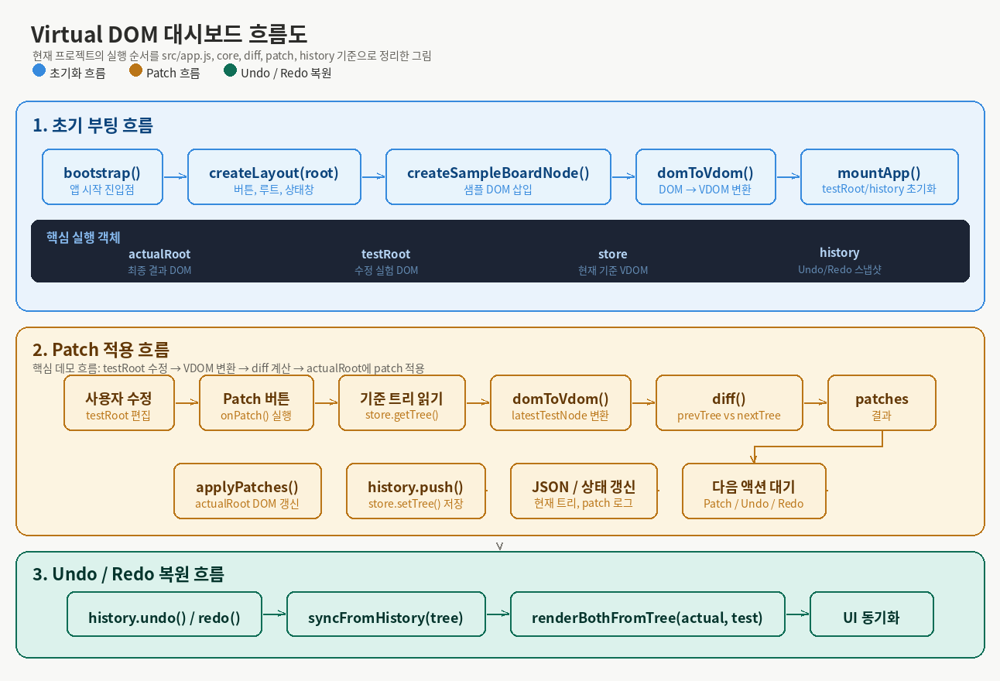

# Virtual DOM 프로젝트 흐름도

이 문서는 화면 배치 설명이 아니라, 현재 프로젝트가 **어떤 코드 순서로 동작하는지**를 정리한 설명서다.  
기준은 `src/app.js`의 `bootstrap()`, `getDraftDiff()`, `renderDraftDiff()`, `onPatch()`, `syncFromHistory()` 흐름이며, 여기에 연결된 `src/ui/controls.js`, `src/ui/nexusDemo.js`, `src/ui/jsonTreeViewer.js`의 역할까지 함께 본다.

보조 이미지:

## 1. 전체 흐름 요약

현재 프로젝트는 아래 순서로 움직인다.

1. 샘플 DOM을 만든다.
2. 그 DOM을 초기 VDOM(`initialTree`)으로 바꾼다.
3. 같은 트리를 `testRoot`에 렌더링해 편집 공간을 만든다.
4. `bindControls()`가 버튼, 입력, drag-and-drop 이벤트를 연결한다.
5. 첫 렌더 직후 `seedNexusDemo()`가 테스트 영역을 최신 Nexus 보드로 다시 채우고 첫 Patch를 수행한다.
6. 사용자가 `testRoot`를 수정할 때마다 draft diff와 tree preview를 다시 계산한다.
7. 사용자가 `Patch` 버튼을 누르면 draft 결과를 `actualRoot`에 반영한다.
8. 반영된 트리를 `store`와 `history`에 저장한다.
9. 필요하면 `Undo / Redo`로 저장된 트리를 복원한다.

핵심 한 줄:

**사용자 수정 -> testRoot를 VDOM으로 변환 -> draft diff 미리보기 -> Patch 시 actualRoot 반영 -> history 저장**

## 2. 초기 부팅 흐름

`bootstrap()` 기준 순서는 아래와 같다.

1. `createLayout(root)`가 전체 UI 껍데기를 만든다.
2. `createSampleBoardNode()`가 현재 샘플 보드를 실제 DOM으로 만든다.
3. 샘플 DOM을 `actualRoot`에 먼저 넣는다.
4. `domToVdom(ui.actualRoot.firstElementChild)`로 `initialTree`를 만든다.
5. `mountVdom(ui.testRoot, initialTree)`로 같은 트리를 `testRoot`에도 렌더링한다.
6. `createStore(initialTree)`와 `new History(initialTree)`로 기준 트리와 이력을 초기화한다.
7. `renderJson(ui.currentTreeViewer, store.getTree())`로 현재 트리 뷰를 초기화한다.
8. `renderJson(ui.patchViewer, [])`로 diff/panel을 비운다.
9. `syncControlState(ui, history)`로 undo/redo 버튼 상태를 맞춘다.
10. `bindControls(ui, { onPatch, onUndo, onRedo, onDraftChange })`로 이벤트를 연결한다.

즉 시작 직후에는 아래 네 가지가 같은 기준을 바라본다.

- `actualRoot`: 실제 반영 화면
- `testRoot`: 편집용 실험 화면
- `store`: 현재 diff의 oldTree 기준
- `history`: undo/redo 복원용 스냅샷

## 3. 첫 시드 흐름

현재 프로젝트는 이벤트 연결 뒤 `setTimeout(..., 0)`으로 `seedNexusDemo()`를 한 번 실행한다.

`seedNexusDemo()`의 순서:

1. `ui.testRoot.replaceChildren(createNexusBoard())`로 최신 Nexus 보드를 테스트 영역에 다시 채운다.
2. `handlers.onPatch()`를 호출해 이 상태를 기준 상태로 반영한다.
3. `reconcileIfNeeded(ui)`로 실제 영역과 테스트 영역의 DOM 차이를 한 번 더 맞춘다.
4. `handlers.onDraftChange?.()`로 draft preview를 다시 갱신한다.
5. 상태 문구를 초기화 완료 메시지로 바꾼다.

즉 현재 프로젝트의 시작 상태는 단순히 샘플 DOM을 그리는 데서 끝나지 않고, **Nexus 보드를 다시 시드한 뒤 첫 Patch와 preview 동기화까지 마친 상태**다.

## 4. Draft diff 미리보기 흐름

현재 프로젝트의 중요한 변화는 **Patch 버튼을 누르기 전에도 diff를 계속 계산해서 보여준다는 점**이다.

핵심 함수는 `getDraftDiff()`와 `renderDraftDiff()`다.

### `getDraftDiff()`

1. `ui.testRoot.firstElementChild`를 읽는다.
2. 없으면 `null`을 반환한다.
3. 있으면 `domToVdom(latestTestNode)`로 `nextTree`를 만든다.
4. `diff(store.getTree(), nextTree)`로 draft patch를 계산한다.
5. `{ nextTree, patches }`를 반환한다.

### `renderDraftDiff()`

1. `getDraftDiff()`를 호출한다.
2. draft가 있으면 `renderTreePreview(draft.nextTree)`로 현재 편집 상태의 트리를 그린다.
3. draft가 없으면 `store.getTree()`를 기준으로 tree preview를 그린다.
4. `renderJson(ui.patchViewer, draft ? draft.patches : [])`로 diff JSON, patch log, highlight를 갱신한다.

즉 지금은 사용자가 수정하는 동안 아래 요소들이 즉시 갱신된다.

- Diff JSON
- Real-time Patch Log
- Tree Visualizer
- actual/test 영역 patch target highlight

## 5. 사용자의 편집 이벤트 흐름

`bindControls()`와 `bindNexusEditor()`는 편집 이벤트를 아래처럼 연결한다.

### 장치 상태 버튼 클릭

- 전등 `ON/OFF`
- 에어컨 `RUNNING/STOPPED`
- 카메라 `recording/idle`

이 버튼을 누르면 `testRoot` 안의 `data-*` 값과 readout 텍스트가 바뀌고, 이어서 `onChange()`가 호출돼 `renderDraftDiff()`가 다시 돈다.

### 에어컨 온도 입력

- 입력값을 `16~30` 범위로 보정한다.
- input의 `value` attribute도 함께 업데이트한다.
- readout 텍스트를 `24C`, `25C`, `OFF` 같은 표시로 동기화한다.
- 이후 `onChange()`가 호출돼 draft diff가 다시 계산된다.

### room card drag-and-drop

- 방 제목(`data-drag-handle="true"`)을 잡고 drag하면 `bindRoomDnD()`가 동작한다.
- 내부적으로 `dropSlot`을 사용해 삽입 위치를 표시한다.
- 순서가 실제로 달라졌을 때만 상태 문구를 바꾸고 `onChange()`를 호출한다.

### room card 테마 토글

- 카드 헤더의 `toggle-card-theme` 버튼을 누르면 `.is-dark` 클래스가 토글된다.
- `syncBoardPresentation()`이 `data-theme`와 버튼 텍스트를 다시 맞춘다.
- 이후 `onChange()`가 호출돼 draft diff에 즉시 반영된다.

즉 편집 흐름의 핵심은 아래와 같다.

**testRoot DOM 수정 -> onChange() -> renderDraftDiff() -> diff/log/tree/하이라이트 갱신**

## 6. Patch 적용 흐름

사용자가 `Patch` 버튼을 누르면 `onPatch()`가 아래 순서로 실행된다.

1. `getDraftDiff()`로 `nextTree`와 `patches`를 가져온다.
2. draft가 없으면 상태 문구만 바꾸고 종료한다.
3. patch가 0개면 실제 반영 없이 draft preview만 다시 그린다.
4. patch가 있으면 `ui.actualRoot.firstElementChild`를 기준으로 `applyPatches(currentActualNode, patches)`를 호출한다.
5. 루트가 교체된 경우 `ui.actualRoot.replaceChildren(updatedNode)`로 교체한다.
6. `history.push(nextTree)`와 `store.setTree(nextTree)`로 새 기준을 저장한다.
7. `renderJson(ui.currentTreeViewer, nextTree)`로 before/after 트리 뷰를 갱신한다.
8. `renderDraftDiff()`를 다시 호출해 patch viewer를 최신 기준으로 맞춘다.
9. `syncControlState(ui, history)`로 undo/redo 버튼 상태를 갱신한다.
10. 상태 문구에 `patchSummary(patches)` 결과를 표시한다.

즉 `Patch`는 단순한 버튼 이벤트가 아니라 아래 처리 파이프라인이다.

**draft 계산 -> actualRoot에 patch 적용 -> store/history 저장 -> 뷰어와 preview 재동기화**

## 7. Patch 이후 보정 흐름

`controls.js`의 patch 버튼 핸들러는 `handlers.onPatch()` 뒤에 `reconcileIfNeeded(ui)`를 한 번 더 수행한다.

이 단계의 의미:

- `actualRoot`와 `testRoot`의 `outerHTML`이 다르면
- 테스트 영역 DOM을 clone해서 실제 영역을 다시 맞춘다

즉 patch 적용 뒤에 눈에 보이는 DOM 차이가 남아 있으면 마지막에 한 번 더 두 영역을 동기화하는 안전장치가 있다.

## 8. Undo / Redo 복원 흐름

`Undo / Redo`는 diff를 다시 계산해 반영하는 흐름이 아니라, 저장된 트리를 통째로 복원하는 흐름이다.

1. `history.undo()` 또는 `history.redo()`를 호출한다.
2. 복원할 트리를 받으면 `syncFromHistory(tree, actionText)`가 실행된다.
3. `store.setTree(tree)`로 현재 기준 트리를 교체한다.
4. `renderBothFromTree(ui, tree)`로 `actualRoot`와 `testRoot`를 같은 상태로 다시 렌더링한다.
5. `renderJson(ui.currentTreeViewer, tree)`로 현재 트리 뷰를 갱신한다.
6. `renderDraftDiff()`를 다시 호출해 patch viewer와 tree preview도 현재 기준으로 맞춘다.
7. `syncControlState(ui, history)`로 버튼 상태를 갱신한다.

정리하면:

- `Patch`: 차이를 계산해서 실제 DOM에 반영
- `Undo / Redo`: 저장된 트리를 통째로 복원

## 9. `jsonTreeViewer.js`가 담당하는 시각화 흐름

현재 프로젝트는 단순히 JSON을 문자열로 찍는 것이 아니라, 여러 시각화가 함께 움직인다.

### `renderJson(ui.currentTreeViewer, tree)`

- 이전 after 트리를 before로 보관한다.
- 현재 트리를 after로 렌더한다.
- 동시에 `renderTreePreview(after)`를 호출해 tree graph를 갱신한다.

### `renderJson(ui.patchViewer, patches)`

- patch 배열을 보기 좋은 구조로 변환한다.
- JSON tree 형식으로 출력한다.
- `renderPatchLog(patches)`로 로그를 갱신한다.
- `highlightPatchTargets(patches)`로 graph node와 DOM node에 하이라이트를 준다.

즉 현재 UI에서 diff는 아래 4가지 표현으로 동시에 보인다.

- JSON diff tree
- patch log
- tree graph
- patch target highlight

## 10. 핵심 객체 정리

- `actualRoot`: 최종 결과가 보이는 실제 화면 DOM
- `testRoot`: 사용자가 수정 중인 실험용 DOM
- `store`: 현재 diff의 oldTree 기준 VDOM
- `history`: undo/redo용 스냅샷 목록
- `patchViewer`: 현재 draft 또는 최신 patch 목록
- `currentTreeViewer`: before/after VDOM 비교 뷰
- `patch-log`: 사람이 읽기 쉬운 patch 로그
- `tree-graph`: SVG 기반 VDOM 시각화 영역

## 11. 이 문서에서 특히 중요한 포인트

- 현재 프로젝트는 `Patch` 버튼을 누르기 전에도 draft diff를 계속 계산한다.
- 실제 반영은 `Patch` 버튼에서만 일어난다.
- room reorder와 카드 테마 토글도 이제 편집 흐름에 포함되어 있다.
- `domToVdom()`의 child filtering 규칙은 Diff path, Patch target, Tree Visualizer highlight와 직접 연결된다.
- `Undo / Redo`는 `diff()`를 다시 돌리는 것이 아니라 저장된 트리를 복원한다.

## 12. 발표용 요약 문장

이 프로젝트는 **실제 DOM을 VDOM으로 변환해 기준 트리를 만들고, 테스트 영역에서 수정된 DOM을 계속 draft VDOM으로 바꿔 diff와 tree preview를 미리 보여준 뒤, 사용자가 Patch를 누르면 필요한 변경만 실제 화면에 적용하고 history로 상태를 관리하는 구조**다.
