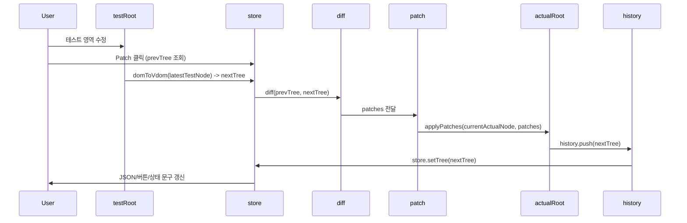

# Virtual DOM 프로젝트 전체 흐름

`src/app.js` 기준으로, 이 프로젝트의 실행 흐름을 "초기화 -> Patch -> Undo/Redo" 순서로 한눈에 볼 수 있게 정리했다.


---

## 1) 전체 흐름 한눈에 보기

```mermaid
flowchart LR
  A[앱 시작<br/>bootstrap()] --> B[UI 레이아웃 생성<br/>createLayout]
  B --> C[샘플 DOM 생성 후 actualRoot 탑재<br/>createSampleBoardNode]
  C --> D[actualRoot DOM -> initialTree<br/>domToVdom]
  D --> E[testRoot에 initialTree 렌더링<br/>mountVdom]
  E --> F[store/history 초기화]
  F --> G[사용자 상호작용]

  G --> H[Patch 버튼]
  H --> I[testRoot DOM -> nextTree]
  I --> J[diff prev vs next]
  J --> K[applyPatches to actualRoot]
  K --> L[history.push + store.setTree]
  L --> M[JSON/상태/버튼 UI 갱신]

  G --> N[Undo/Redo 버튼]
  N --> O[history.undo/redo]
  O --> P[store.setTree]
  P --> Q[actualRoot + testRoot 동시 재렌더]
  Q --> M
```

---

## 2) 단계별 흐름

### A. 초기 부팅 (Bootstrap)

1. `createLayout(root)`로 기본 UI(버튼/상태/JSON 뷰어)를 만든다.
2. `createSampleBoardNode()`로 샘플 보드를 만든 뒤 `actualRoot`에 넣는다.
3. `domToVdom(ui.actualRoot.firstElementChild)`로 `initialTree`를 만든다.
4. `mountVdom(ui.testRoot, initialTree)`로 테스트 영역을 동기화한다.
5. `createStore(initialTree)`, `new History(initialTree)`로 기준 상태를 잡는다.

초기화가 끝나면 `actualRoot`, `testRoot`, `store`, `history`가 모두 같은 트리를 바라본다.

### B. Patch 버튼 핵심 흐름



핵심 문장: **수정된 테스트 DOM을 VDOM으로 바꾼 뒤, 이전 VDOM과 비교(diff)해서 실제 화면에는 필요한 변화만 patch한다.**

### C. Undo / Redo 흐름

1. `history.undo()` 또는 `history.redo()`로 복원할 트리를 가져온다.
2. `store.setTree(tree)`로 현재 기준 트리를 교체한다.
3. `renderBothFromTree()`로 `actualRoot`, `testRoot`를 동일 상태로 렌더링한다.
4. JSON/버튼/상태 문구를 갱신한다.

즉, Undo/Redo는 **차이 계산(diff) 없이 저장된 스냅샷을 복원**하는 흐름이다.

---

## 3) 역할별 핵심 객체

- `actualRoot`: 최종 결과가 보이는 실제 화면 DOM
- `testRoot`: 실험/수정용 DOM 영역
- `store`: 현재 비교 기준 VDOM(`prevTree`) 저장
- `history`: undo/redo용 스냅샷 스택
- `patchViewer`: diff 결과(`patches`)를 시각적으로 확인

---

## 4) 발표용 한 줄 스토리

이 프로젝트는 **실제 DOM을 VDOM으로 기준화하고, 테스트 영역 변경분을 diff로 계산해 최소 patch만 반영하며, 상태는 history로 되돌릴 수 있게 만든 Virtual DOM 실습 구조**다.
